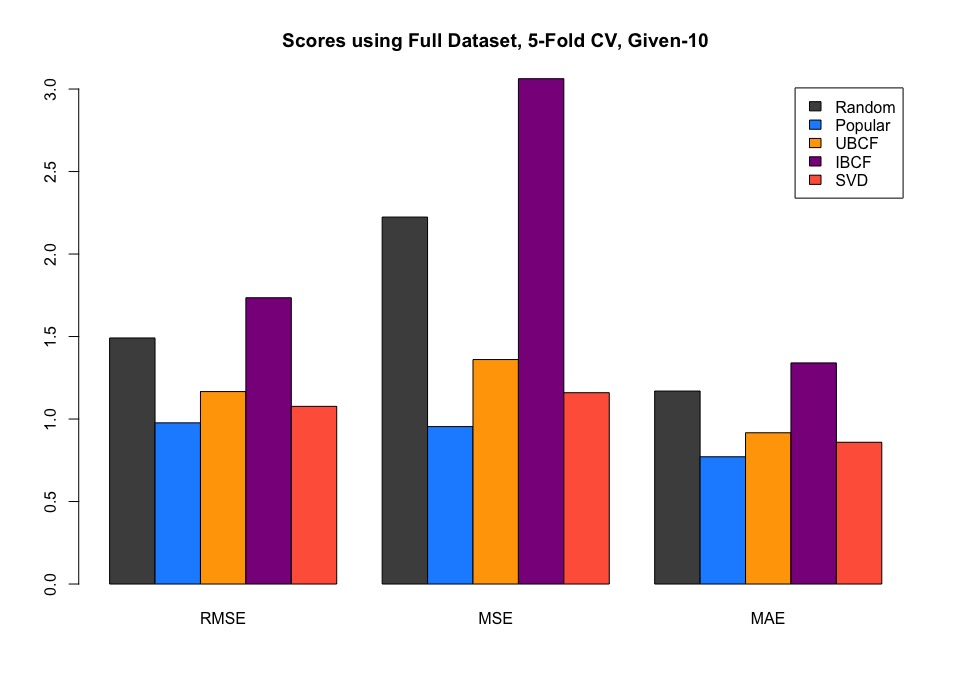

# Setup

```{r libraries, message=FALSE, cache = T}
library(recommenderlab)
library(Matrix)
library(dplyr)
library(plyr)
library(data.table)
set_cache = T
```

First we load and parse the Movie and Ratings data.  We do not load the images in this Markdown doc for ease of processing nor do we load the users since we do not use their information for any of our systems/algorithms.

```{r get-data}
##ratings
myurl = "https://liangfgithub.github.io/MovieData/"
ratings = read.csv(paste0(myurl, 'ratings.dat?raw=true'), 
                   sep = ':',
                   colClasses = c('integer', 'NULL'), 
                   header = FALSE)
colnames(ratings) = c('UserID', 'MovieID', 'Rating', 'Timestamp')
ratings = ratings[, -4]   #dont need timestamp

##movies
movies = readLines(paste0(myurl, 'movies.dat?raw=true'))
movies = strsplit(movies, split = "::", fixed = TRUE, useBytes = TRUE)  #seperated by ::
movies = matrix(unlist(movies), ncol = 3, byrow = TRUE)  #is a list of lists
movies = data.frame(movies, stringsAsFactors = FALSE)  # one line per movie unlike the ratings
colnames(movies) = c('MovieID', 'Title', 'Genres')
movies$MovieID = as.integer(movies$MovieID)  #treats MovieID as a character which makes difficult to matchup

# convert accented characters
movies$Title = iconv(movies$Title, "latin1", "UTF-8")

# extract year from movie title
movies$Year = as.numeric(unlist(
  lapply(movies$Title, function(x) substr(x, nchar(x)-4, nchar(x)-1))))  
```

# System 1 Genre Recommendations
## Algorithm 1 - 'Margin Ratings'
For the first algorithm we rate movies based on the size of their margins.  That is we suggest the top movies based on the absolute value of the sum of their centered ratings.  The thinking is that many movies are popular because they are "so bad they're good".  We also keep the 'raw margin' since after processing we wont know which movies had their signs flipped.

```{r calculate_margin_rating, cache = set_cache}
n_movies = nrow(movies)
movies$margin_rating = NA
movies$raw_margin = NA

for (i in 1:n_movies) {
  #snag each movie by their ID#
  id = movies$MovieID[i]
  
  #get all ratings matching that ID#
  ratings_for_movie = ratings[ratings$MovieID == id, "Rating"]
  ratings_for_movie = ratings_for_movie - 3 # center onto 0
  
  #get raw margin for exploration
  movies[i, "raw_margin"] = sum(ratings_for_movie)
  
  # calculate and store margin (sum + abs)
  movies[i, "margin_rating"] = abs(sum(ratings_for_movie))
}
```

======poorley written

Somewhat surprisingly, there are a significant amount of movies that have a large negative margin rating.  The hope is that for certain categories the caterogy isnt dominated by lots of overwhelmingly popular movies (like "Action") at least some of these 'so bad they're good movies' will make it into the recommendations.
```{r margin-ratings-graph, cache = set_cache}
clrs = c(rep('tomato', 8), rep('dodgerblue', 10))
hist(movies$raw_margin[movies$raw_margin < 800],
     xlim = c(-800, 800),
     breaks = 20,
     col = clrs,
     main = 'Raw Ratings within 2 Standard Deviations')
```

Next we create the genre suggestions.  We select the top 50 for each genre and save them as a cvs to make loading recommendations easier/quicker later on.  The assumption here is that most people would not look beyond the first 10 recommendations much less the first 50. 

```{r write-recommendations-S1A, cache = set_cache}
genre_list = c("Action", "Adventure", "Animation",
    "Children's", "Comedy", "Crime", "Documentary",
    "Drama", "Fantasy", "Film-Noir", "Horror",
    "Musical", "Mystery", "Romance", "Sci-Fi",
    "Thriller", "War", "Western")
  
#turn movies/genres into a boolean matrix of movies x genres
genres = as.data.frame(movies$Genres, stringsAsFactors = FALSE)
tmp = as.data.frame(tstrsplit(genres[, 1], '[|]',
                              type.convert = TRUE),
                    stringsAsFactors = FALSE)
genre_matrix = matrix(0, nrow(movies), length(genre_list))
for (i in 1:nrow(tmp)) {
  genre_matrix[i, genre_list %in% tmp[i, ]] = 1
}
colnames(genre_matrix) = genre_list
remove("tmp", "genres")

#create a matrix 50 movies x genre
genre_recs_mat = matrix("-", 50, length(genre_list))
colnames(genre_recs_mat) = genre_list

#for each genre
for (g in genre_list) {
  #grab all movies that are tagged with that genre
  m = which(genre_matrix[, g] == 1)
  movs = movies[m, c("MovieID", "margin_rating")]
  
  #sort by margin rating
  movs = arrange(movs, desc(margin_rating))
  genre_recs_mat[, g] = movs$MovieID[1:50]
}

#save recommendations for later
write.csv(genre_recs_mat,
  file = "genre_recommendations_margin_S1A.csv",
  row.names = F)
```

```{r prep-S1A, cache = set_cache}
genre_recs_margin = as.data.frame(read.csv('genre_recommendations_margin_S1A.csv',
                                           header = T))

system1A = function(sel_genre, n = 10){return(genre_recs_margin[1:n, sel_genre])}
```

We test our system by asking for the top 5 movie recommendations in the Genre 'Film-Noir' using System 1A.

```{r run-S1A, cache = set_cache}
recs = system1A('Children.s', 5)
movies[movies$MovieID %in% recs, 'Title']
```

## Algorithm 2 - Naive Popular Approach with Minimum Support
Next we try a "Naive Popular Approach with Minimum Support".  This algorithm is aimed at returning popular movies based on a common understanding of 'popular'.  We disgard any movie with less than 100 reviews and then calculate the average rating for each movie with no modifications.  Thankfully becuase movies with a large number of reviews will have slightly different average ratings (out to at least the 1000ths place) there should be very few ties when ranking the movies by their popularity.

We choose 100 as the activation threshold since the average number of reviews per movie is around 250.  The assumption being that if a movie doesnt garner at least 100 reviews (no matter how high their overall rating is) we wouldnt consider them 'popular'.  

```{r calc-popular-S1B, cache = set_cache}
n_movies = nrow(movies)
movies$popularity_rating = NA

for (i in 1:n_movies) {
  #snag each movie by their ID#
  id = movies$MovieID[i]
  
  #get all ratings matching that ID#
  ratings_for_movie = ratings[ratings$MovieID == id, "Rating"]
  
  if(length(ratings_for_movie) >= 100)
    {avg_rating = mean(ratings_for_movie)}
  else
    {avg_rating = 0}
  movies[i, "popularity_rating"] = avg_rating
}
```

```{r write-popularRecs-S1B, cache = set_cache}
#turn movies/genres into a boolean matrix of movies x genres
genres = as.data.frame(movies$Genres, stringsAsFactors = FALSE)
tmp = as.data.frame(tstrsplit(genres[, 1], '[|]',
                              type.convert = TRUE),
                              stringsAsFactors = FALSE)
genre_matrix = matrix(0, nrow(movies), length(genre_list))
for (i in 1:nrow(tmp)) 
  {genre_matrix[i, genre_list %in% tmp[i, ]] = 1}
colnames(genre_matrix) = genre_list
remove("tmp", "genres")

#create a matrix 50 movies x genre
genre_recs_mat = matrix("-", 50, length(genre_list))
colnames(genre_recs_mat) = genre_list

#for each genre
for (g in genre_list) {
  #grab all movies that are tagged with that genre
  m = which(genre_matrix[, g] == 1)
  movs = movies[m, c("MovieID", "popularity_rating")]
  
  #sort by margin rating
  movs = arrange(movs, desc(popularity_rating))
  genre_recs_mat[, g] = movs$MovieID[1:50]
}

#save recommendations for later
write.csv(genre_recs_mat,
          file = "genre_recommendations_S1B.csv",
          row.names = F)
```

```{r pre-S1B, cache = set_cache}
genre_recs_pop = as.data.frame(read.csv('genre_recommendations_S1B.csv',
                                           header = T))

system1B = function(sel_genre, n = 10){return(genre_recs_pop[1:n, sel_genre])}
```

```{r run-S1B, cache = set_cache}
recs = system1B('Adventure', 5)
movies[movies$MovieID %in% recs, 'Title']
```


# System 2
First we create a small helper function to return our ratings in a *user x movie* `realRatingMatrix` that is the preferred object in `recommenderLab`.
```{r helper-functions, cache = set_cache}
create_rating_matrix = function(ratings_df){
  #create a sparse matrix with data x at location i,j
  i = paste0('u', ratings_df$UserID) #user number ...
  j = paste0('m', ratings_df$MovieID) #movie number ...
  x = ratings_df$Rating
  
  #nessecary to prevent sparseMatrix freaking out over i + j being characters instead of integers
  tmp = data.frame(i, j, x, stringsAsFactors = T)
  Rmat = sparseMatrix(as.integer(tmp$i), as.integer(tmp$j), x = tmp$x)
  #the levels for each are the order in which the data is already entered into the matrix
  rownames(Rmat) = levels(tmp$i)
  colnames(Rmat) = levels(tmp$j)
  
  #realRatingMatrix is an actual datatype.  
  #For whatever reason Recommender() requires a specific type of matrix object
  Rmat = new('realRatingMatrix', data = Rmat)
}
```

# Exploration of Methods available from Recommender Lab

We first did an exploratory run of the most common filtering methods.  We included Random as the base line and then tested: Popular, User-Based CF, Item-Based CF, and SVD.  

```{r eda, eval = F}
Rmat = create_rating_matrix(ratings)
r_eval_scheme = evaluationScheme(Rmat,
                                 method = 'cross', k = 5, 
                                 given = 10, goodRating = 5)
algos = list(
  "Random"  = list(name = "RANDOM", param = NULL),
  'Popular' = list(name = 'POPULAR', param = NULL),
  'UBCF'    = list(name = 'UBCF', param = list(nn = 25)),
  'IBCF'    = list(name = 'IBCF', param = list(k = 25)),
  'SVD'     = list(name = 'SVD', param = list(k = 25))
)

results = evaluate(r_eval_scheme, algos, type = 'ratings')

clrs = c('gray30', 'dodgerblue', 'orange', 'magenta4', 'tomato')
plot(results, 'prec/rec', 
     main = ,
     col = clrs)
title(main = "Scores using Full Dataset, 5-Fold CV, Given-10")
```

Interestingly Item-Based CF does terribly in this setup, even worse than Random.  This seemed counter-intuitive so we re-ran the evaluation while using *all but 2* to give the recommender system the most data to train on.  Unfortunately, this only led to a slight improvement in the IBCF and it remained about on par with just randomly suggesting a movie to a given user.




## Algorithm 1 - SVD
SVD is the first algorithm that we train a recommend system on.  At first SVD doesn't seem like a logical choice since it does not use/give direct probabilities and is more suited to a binary classification setting.  We also run into the problem that the function being used by `recommenderLab` is not SVD in a traditional sense.  It does not use a controllable cost parameter to enfluence the splitting.  However based on our exploratory run it does at least as well as UBCF.

```{r S2A1-SVD-sim, cache = set_cache}
num_iterations = 10
rmse_SVD = integer(num_iterations)
Rmat  = create_rating_matrix(ratings)

for(i in 1:num_iterations){
  r_eval_scheme = evaluationScheme(Rmat, 
                                   method = 'split', train = 0.8, 
                                   given = 10, goodRating = 5)
  rec_SVD = Recommender(getData(r_eval_scheme, 'train'), 
                         method = 'SVD',
                         parameter = list(normalize = 'center', k = 25))
  preds   = predict(rec_SVD, getData(r_eval_scheme, 'known'), type = 'ratings')
  
  #calculate RMSE
  error = calcPredictionAccuracy(preds, getData(r_eval_scheme, 'unknown'))
  rmse_SVD[i] = error[[1]]
}
```

```{r svd-graph, cache = set_cache}
{barplot(rmse_svd,
        ylim = c(0.6, 1.4),
        ylab = 'RMSE',
        xlab = 'Iteration',
        main = 'Error over 10 iterations for SVD Recommender',
        col = 'tomato',
        xaxt = "")
axis(1, at = c(1:10), labels = c(1:10))
text(bp, rmse_SVD + 0.4, rmse_SVD, cex=1) 
abline(h = mean(rmse_SVD), lty = 4, lwd = 2)}
```


## Algorithm 2 - UBCF

Our second algorithm is User-Based CF.  Although UBCF is a computationally intensive method that did worse than the 'popular' method in our EDA we choose it purely based on our own personal interest in how it works.

```{r S2A2-UBCF-sim, cache = set_cache}
num_iterations = 10
rmse_UBCF = integer(num_iterations)

for(i in 1:num_iterations){
  r_eval_scheme = evaluationScheme(Rmat, 
                                   method = 'split', train = 0.8, 
                                   given = 10, goodRating = 5)
  rec_UBCF = Recommender(getData(r_eval_scheme, 'train'), 
                         method = 'UBCF',
                         parameter = list(normalize = 'center', nn = 25))
  preds = predict(rec_UBCF, getData(r_eval_scheme, 'known'), type = 'ratings')
  
  #calculate RMSE
  error = calcPredictionAccuracy(preds, getData(r_eval_scheme, 'unknown'))
  rmse_UBCF[i] = error[[1]]
}
```


```{r UBCF-graph, cache = set_cache}
{barplot(rmse_UBCF,
        ylim = c(0.6, 1.4),
        ylab = 'RMSE',
        xlab = 'Iteration',
        main = 'Error over 10 iterations for UBCF Recommender',
        col = 'orange',
        xaxt = "")
axis(1, at = c(1:10), labels = c(1:10))
text(bp, rmse_UBCF + 0.4, rmse_UBCF, cex=1) 
abline(h = mean(rmse_UBCF), lty = 4, lwd = 2)}
```

